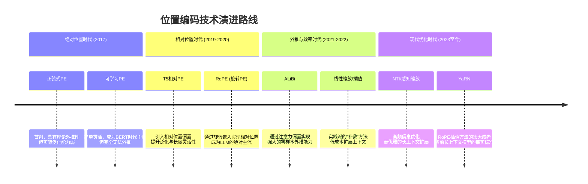

>这是一个非常核心的问题！位置编码技术是Transformer架构中**让模型理解“顺序”的关键组件**。
  想象一下这个场景：如果没有位置编码，模型会把句子 “猫追老鼠” 和 “老鼠追猫” 看成是完全一样的，因为它只看到了{猫，追，老鼠}这三个词，而不知道谁在前谁在后。位置编码，就是给模型装上的“顺序感知器”。
# 概念
## 核心定义与目的
位置编码是一种将序列中每个元素的位置信息（第1个、第2个……）注入到模型中的技术。
* 为什么需要它？ Transformer的核心——**自注意力机制本身是排列不变的**。它计算一个词与其他所有词的关系时，并不关心这些词的物理顺序。就像把一句话的单词打乱后，注意力算出的关联权重总和可能不变。
* 核心目的：打破这种排列不变性，让模型知道序列的**时序、顺序或空间结构**。
## 核心原理
核心思想很简单：为序列中的每个位置（索引）生成一个独一无二的向量，然后把这个向量加到对应位置的词嵌入向量上。
**输入模型的实际向量 = 词嵌入向量 + 位置编码向量** 
这样，即使两个词是相同的（如两个“的”），只要它们在不同位置，最终的输入向量就是不同的，模型就能区分它们。

# 技术演进

## 详细解析各阶段技术与优劣
###  绝对位置编码时代
**正弦/余弦位置编码**：原始Transformer所用。
优点：具有数学上的周期性，理论上可处理比训练更长的序列；确定性，无需学习。
缺点：实际外推能力非常差；在训练长度外的位置，模型表现急剧下降。现在已很少在大型模型中单独使用。

**可学习的位置嵌入**：BERT、GPT-2等早期模型使用。
优点：简单、灵活，让模型自己学习最佳的位置表示。
缺点：完全无法外推。模型只能处理训练时见过的最大长度，是严格的“长度天花板”。
### 相对位置编码时代
T5的**相对位置偏置**：将位置关系建模为注意力分数的一个可学习的偏置项。
优点：不再关注绝对位置，而是关注token间的相对距离，泛化能力更强，对长度更灵活。
缺点：偏置矩阵大小与相对距离窗口有关，设计上需要预设最大距离。

**RoPE**：通过旋转矩阵将绝对位置编码与相对位置依赖巧妙地结合起来。
原理：对查询和键向量进行旋转，旋转角度与位置id成比例。注意力分数仅依赖于token间的相对位置差。
优点：
同时拥有绝对位置的明确性和相对位置的泛化性。
强大的长度外推潜力（虽然原始形式外推有限，但易于优化）。
在线性Attention等机制中仍能保持相对性。
缺点：原始形式对远超训练长度的序列外推效果会衰减（出现“高频丢失”问题）。

**ALiBi**：在注意力分数上直接加一个与相对距离成负比的线性偏置。
优点：
惊人的零样本长度外推能力。例如，用1K长度训练，可直接推理32K长度且性能下降很少。
无需位置嵌入，节省参数。
实现极其简单。
缺点：偏置函数形式固定（线性），可能不是所有任务或层的最优关系；在训练长度内的性能有时略逊于RoPE。
### 现代长上下文优化时代
**位置插值**：为了解决RoPE外推的“高频丢失”问题，将推理时的位置索引等比例缩小，使其落入训练时的位置范围。
优点：方法简单有效，成为低成本扩展上下文窗口的首选实用方法。例如，将32K模型轻松扩展到100K。
缺点：粗暴的缩放会过度压缩位置信息，导致长距离位置分辨率下降，可能影响模型在长文中的细粒度感知。

**NTK感知缩放插值**：针对RoPE，认识到不同频率的维度对长度扩展的敏感度不同。不对所有维度进行同等缩放，而是高频维度缩放少，低频维度缩放多。
优点：比线性插值更“聪明”，能更好地保留高频位置信息（即近处token的精细位置），从而在长上下文任务上表现更好。

**YaRN**：目前最先进、效果最好的RoPE扩展方法。它结合了NTK感知缩放的思路，并引入了温度缩放来微调注意力分布，同时对短文本性能的影响最小。
优点：在扩展上下文长度（如从4K到128K）时，在长文本任务和短文本任务上都能保持最佳性能平衡。

# 算法介绍
## RoPE
