# 现代大模型（Decoder-only LLM）综述

> 范围说明：本文聚焦 **仅解码器（decoder-only）Transformer** 的语言模型与其"训练—效率—推理部署—对齐"的关键技术栈，并扩展介绍 **多模态大模型（VLM）** 与 **检索增强生成（RAG）** 两大流行方向。

## 图示目录（快速定位）

- Decoder-only block（Pre-Norm）
- 因果掩码：谁能看见谁
- 训练并行：DP / TP / PP / ZeRO（示意）
- MHA / MQA / GQA（K/V 共享示意）
- 全注意力 vs 滑动窗口 vs 局部+全局 token（示意）
- 位置编码：在注意力里落点（流程示意）
- RoPE 扩窗：常见失败模式（示意）
- MoE：路由 + 专家容量（示意）
- 推理服务：Prefill vs Decode（总览）
- 连续批处理：请求在 decode 过程中插入（示意）
- PagedAttention：KV Cache 分页（示意）
- 推测式解码：draft 提案、target 验证（示意）
- 对齐：RLHF vs DPO（流程对比）
- ReAct：推理—行动闭环（示意）
- 多模态 VLM：视觉编码器 + LLM（示意）
- RAG：检索增强生成流程（示意）

---

## 1. 统一视角：从“自回归建模”到“系统工程”

### 1.1 目标函数与生成方式（为什么 decoder-only 成为主流）

仅解码器模型以自回归语言建模为中心目标：
$$\max\; \sum_{t=1}^{T} \log P(x_t\mid x_{<t})$$

它天然对应“逐 token 生成”的推理形态，便于：
- 在推理时使用 **KV Cache** 将每步计算从“全序列重算”变成“增量计算”。
- 与指令微调/偏好对齐配合，形成可控的对话式代理。

---

## 2. 架构基座：Decoder-only Transformer 的关键组件

### 2.1 计算块：注意力 + FFN + 残差 + 归一化

典型的 decoder-only block（以 Pre-Norm 为例）：

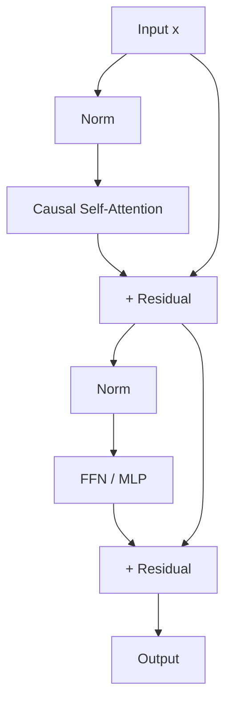

**训练稳定性常见选择**（业界经验总结）：
- **Pre-Norm** 往往比 Post-Norm 更稳定（深层更明显）。
- **RMSNorm**（替代 LayerNorm 的一种常用选择）可减少计算并保持效果。
- **SwiGLU/GEGLU**（替代 ReLU/GELU 的门控 FFN）在许多模型上带来更优的参数效率。

> 这些属于“看似细节、但对大规模训练至关重要”的工程改进：同等算力下更稳定、更易收敛。

### 2.2 因果掩码（Causal Mask）与“可并行训练/顺序推理”

- **训练**：token 位置并行，掩码确保每个位置只看见过去。
- **推理**：自回归顺序生成，依赖 KV Cache 实现高吞吐。

**图：因果掩码的“可见性”示意**

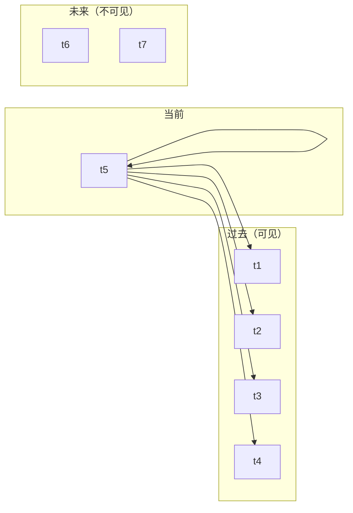

> 注：真实实现是一个上三角为 $-\infty$ 的 mask（softmax 后为 0），图里用“箭头”表达依赖关系。

---

## 3. 规模化训练：数据、优化与并行

### 3.1 Scaling Laws：参数—数据—算力三角

经验扩展律描述了损失随参数规模 $N$ 与数据量 $D$ 的下降趋势。现代训练更强调 **计算最优（compute-optimal）** 的“参数与数据平衡”，典型结论（Chinchilla）是：在固定算力下，过大模型+过少数据会浪费算力。

### 3.2 数据工程（决定上限的往往是数据）

关键要点（只列对性能/稳定性最关键者）：
- **去重与污染控制**：减少训练-评测泄漏；降低“记忆化”与幻觉。
- **质量过滤**：基于规则/分类器过滤低质量网页与重复模板。
- **混合配比**：文本/代码/知识类数据的配比会显著影响能力结构（代码推理、工具使用等）。
- **打包（packing）**：将多个短样本拼接进同一序列，提升 token 利用率。

### 3.3 优化器与训练稳定性（大模型“跑起来”比“写出来”难）

常见训练配置族：
- **AdamW** + **学习率 warmup** + **cosine decay**
- **梯度裁剪**（防止梯度爆炸）
- **混合精度**（FP16/BF16）+ loss scaling（FP16 更常见）
- **激活检查点（activation checkpointing）**：用算力换显存

### 3.4 并行与内存优化：从单卡到千卡

核心手段：
- **数据并行（DP）**：最直观，规模上去后通信成为瓶颈。
- **张量并行（TP）**：切分矩阵乘；大模型几乎必用。
- **流水线并行（PP）**：按层切分；配合 micro-batch。
- **ZeRO / FSDP**：优化参数、梯度、优化器状态的分片与聚合。

**图：DP / TP / PP（概念示意）**

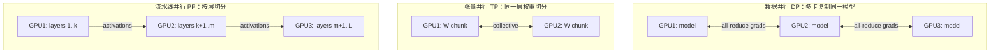

> 备注：现实中常是 DP × (TP+PP) 的混合，并叠加 ZeRO/FSDP 做状态分片。

---

## 4. 注意力机制关键改进：从 $O(T^2)$ 到“可用的长上下文”

### 4.1 MHA → MQA → GQA：降低 KV Cache 成本

推理时，KV Cache 常是显存主导项。将多头注意力（MHA）的“每个头都有独立 K/V”改为共享 K/V：
- **MQA（Multi-Query Attention）**：所有 Q 头共享一组 K/V
- **GQA（Grouped-Query Attention）**：若干个 Q 头共享一组 K/V（折中）

直观效果：
- KV Cache 从 $\mathcal{O}(H)$ 级别下降到 $\mathcal{O}(G)$（$G\ll H$），长上下文推理更省显存。
- 通常对质量影响较小，是“推理友好型”改造。

**图：MHA / MQA / GQA 的 K/V 共享结构（示意）**

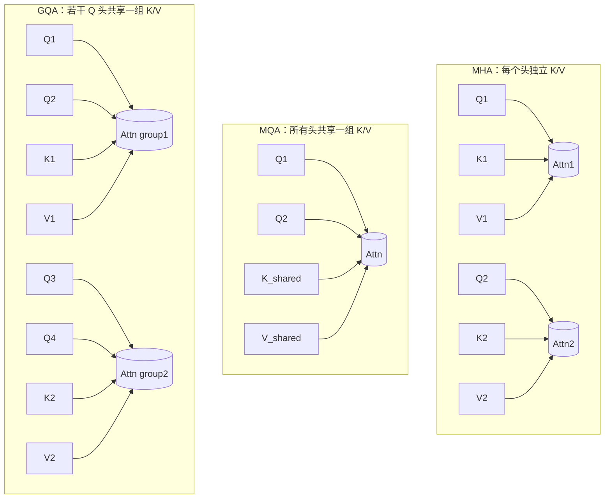

### 4.2 FlashAttention：让注意力在 GPU 上“跑得动”

FlashAttention 的关键不是改变数学形式，而是改变 **计算/IO 调度**：
- block-wise 计算减少 HBM 读写
- 降低峰值显存并提升吞吐

这类优化决定了“能否在同样硬件上把 batch 或上下文做大”。

### 4.3 稀疏与滑动窗口注意力（适合长文档/对话历史）

典型模式：
- **Sliding Window**：只对近邻窗口做注意力（远处信息用摘要/记忆补偿）
- **局部 + 少量全局 token**：对“标题/摘要/系统提示”等 token 给全局注意力

> 现实取舍：纯稀疏注意力常牺牲通用性；实践中更常见的是“滑动窗口 + 更强的长上下文位置编码/训练策略”。

**图：注意力模式对比（示意）**

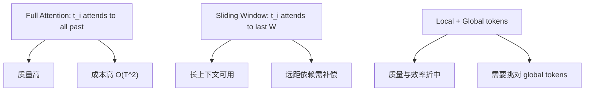

---

## 5. 位置编码与长上下文：RoPE、ALiBi 及其“扩窗”技巧

位置编码决定了模型如何表达顺序与距离，是长上下文能力的关键。

### 5.1 从绝对到相对：主流路线

- **绝对位置编码**：最早期方案，长上下文外推通常较差。
- **相对位置偏置/编码**：更自然表达“相对距离”，外推更好。
- **RoPE（Rotary Position Embedding）**：在大量 decoder-only 模型中成为事实标准。
- **ALiBi**：用线性偏置替代复杂编码，长距离外推强、实现简单。

**图：位置编码在注意力里的落点（抽象流程）**

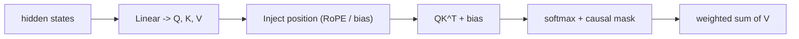

> 这张图强调“位置编码/偏置最终影响的是注意力打分”。RoPE 通过旋转变换改变 Q/K 表示；ALiBi 通过距离 bias 直接改分数。

### 5.2 RoPE 的“扩窗”实践（重要：不仅是公式）

RoPE 常配合“扩窗工程”使用：
- **Position Interpolation**：将训练时的位置映射到更长的推理位置，避免频率过高导致崩溃。
- **NTK scaling / YaRN 类策略**：对频率/缩放做更细分段处理，提升超出训练长度时的稳定性。

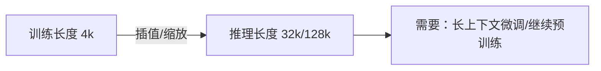

**图：RoPE 扩窗的常见失败模式（示意）**

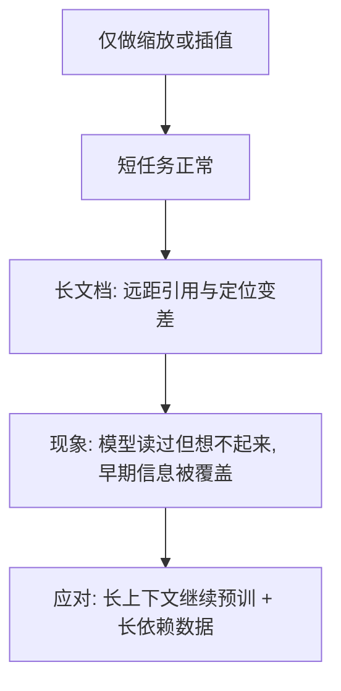

经验结论（偏工程）：
- “只改位置编码就扩窗”通常只能得到 **可用但不可靠** 的长上下文。
- 要在长上下文上真正稳，往往需要：**长上下文继续预训练** 或 **面向长上下文的合成数据**。

---

## 6. FFN 与稀疏化：MoE（Mixture of Experts）

MoE 是提升“参数规模”而不线性增加“计算量”的关键路线之一：
- Dense 模型：每个 token 过所有 FFN 参数
- MoE 模型：每个 token 只激活少数专家（Top-1/Top-2），计算更省

### 6.1 MoE 的基本结构与路由

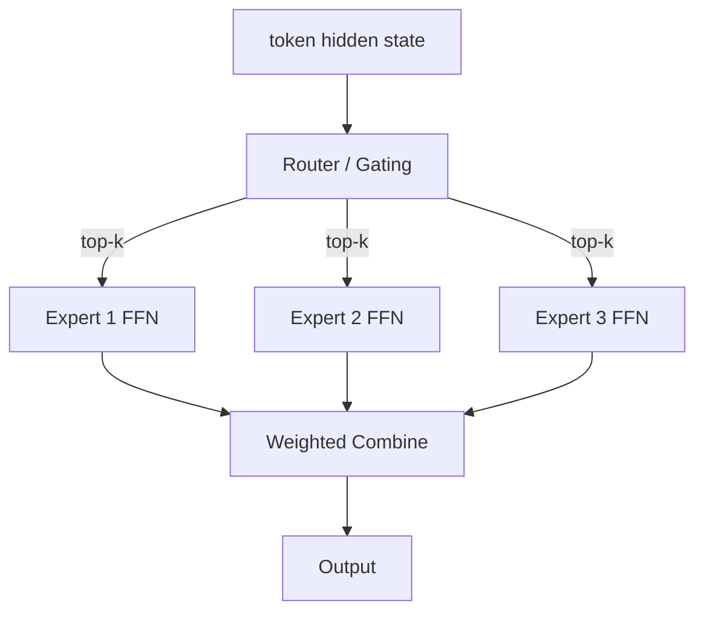

关键难点（也是论文关注点）：
- **负载均衡（load balancing）**：避免少数专家拥塞、其余专家闲置。
- **路由稳定性**：训练早期路由噪声可能导致不稳定。
- **通信成本**：专家并行（expert parallel）带来跨设备 all-to-all。

**图：专家容量（capacity）与“溢出 token”（示意）**

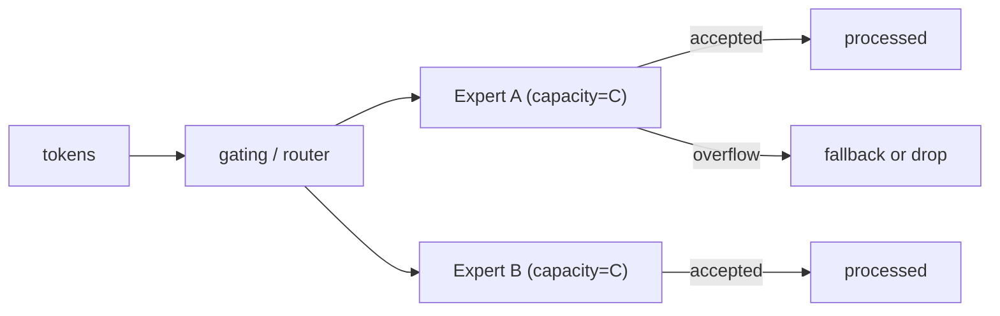

### 6.2 为什么 MoE 重要

MoE 的价值在于“扩参数不等于扩 FLOPs”：
- 同样推理成本下，MoE 可以拥有更大的“记忆/知识容量”。
- 在多任务/多领域场景中，专家可形成一定程度的“功能分工”。

常见取舍：
- MoE 往往更复杂（训练、部署、容错、路由抖动）。
- 小规模推理（低并发）下，MoE 的系统开销可能抵消收益。

---

## 7. 推理与部署优化：把“模型能力”变成“可用服务”

### 7.0 推理服务总览：Prefill vs Decode

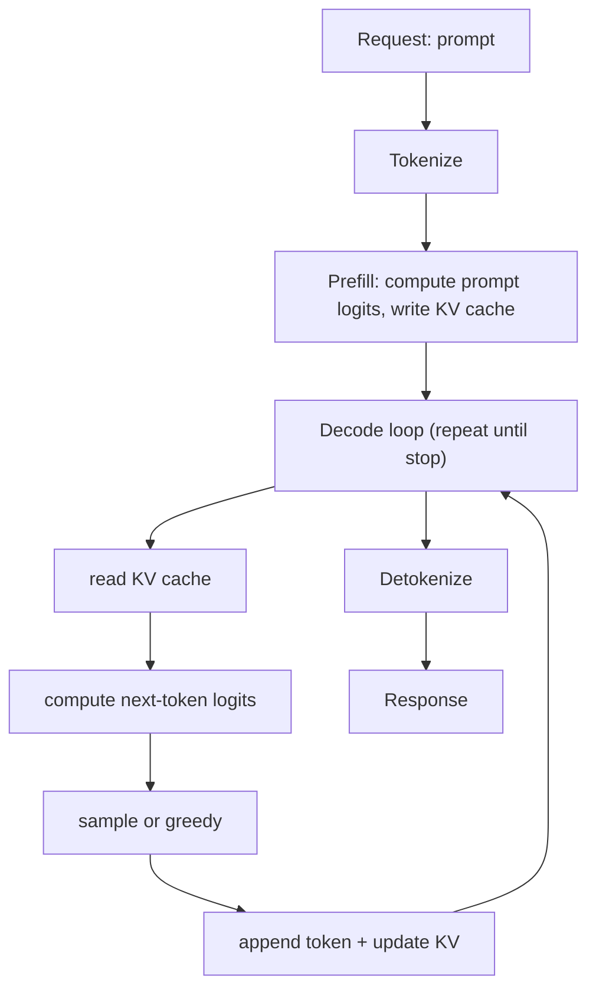

> 记住这个拆分：**Prefill 主要吃 prompt 长度**，**Decode 主要吃生成长度**。

### 7.1 KV Cache：吞吐的核心约束

对 decoder-only 推理而言，KV Cache 直接决定最大 batch 与最大上下文：
- 显存压力来自 $\mathcal{O}(L \cdot T \cdot d)$ 的缓存增长（层数 $L$、长度 $T$）。
- **MQA/GQA** 是从结构上减少缓存体积的主力方案。

**图：KV Cache 增长的直觉（示意）**

```text
每一层：缓存 K 和 V
  - T（上下文更长） => KV 线性更大
  - L（层数更多）   => KV 线性更大
  - H_kv（KV 头更多）=> KV 线性更大（因此 MQA/GQA 很关键）
```

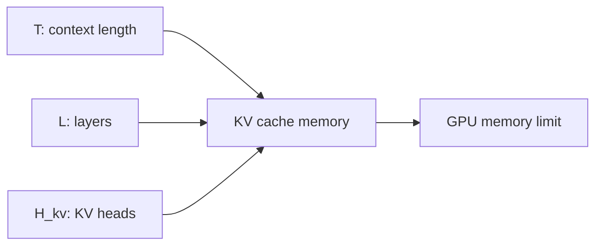

### 7.2 vLLM / PagedAttention：让显存像“虚拟内存”一样管理

现实服务中，请求的长度与生成长度高度不齐：
- 传统做法会产生大量碎片或被迫预留最坏情况
- **PagedAttention** 将 KV Cache 做成分页管理，显著提升显存利用率与吞吐

**图：PagedAttention 的“分页 KV”示意**

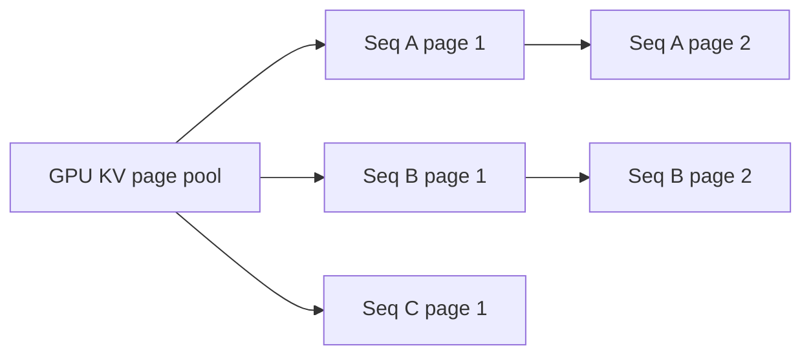

### 7.3 连续批处理（continuous batching）

核心思想：不等待整批完成，而是“边生成边插入新请求”，维持 GPU 高利用率。

**图：连续批处理（时序示意）**

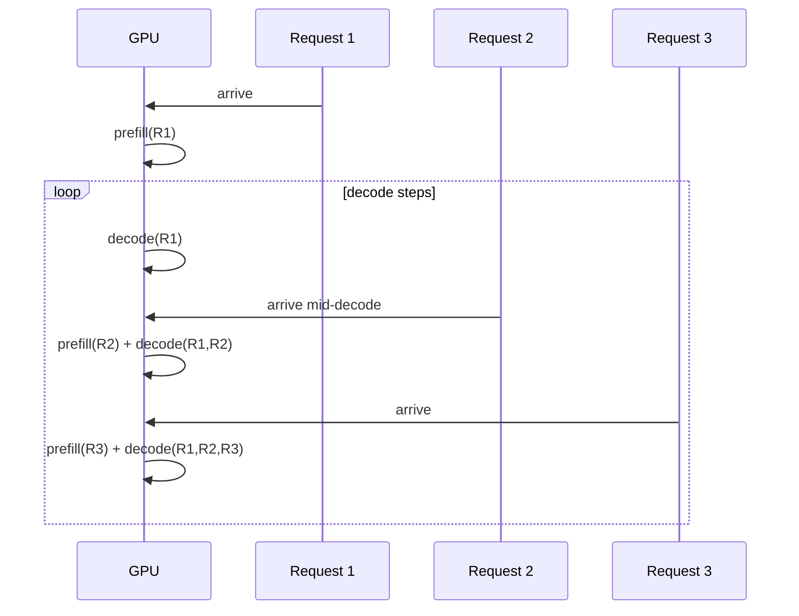

### 7.4 推测式解码（Speculative Decoding）

用一个小模型（draft）提案多个 token，大模型（target）验证：
- 在保持输出分布一致（或可控偏差）的前提下，提高生成速度。

**图：推测式解码（draft 提案、target 验证）**

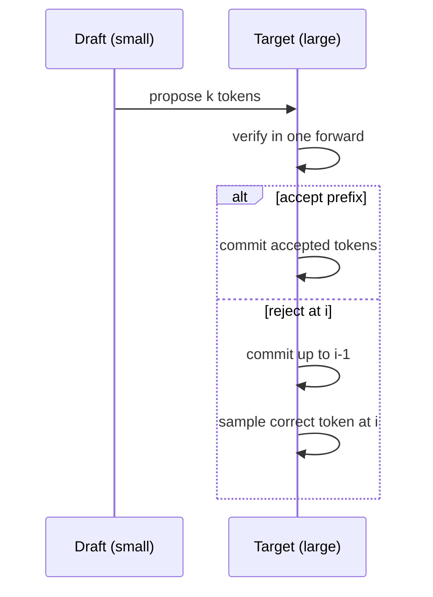

### 7.5 量化与编译

常见路线：
- **PTQ**：如 GPTQ / AWQ 之类的后量化方法（工程上最常用）
- **QAT**：在训练中感知量化误差，通常更稳但成本更高
- **算子融合/编译**：如 TensorRT-LLM 类路径（不同栈名称不同，但核心是融合与内核优化）

---

## 8. 对齐与可控性：从“会说话”到“愿意好好说话”

### 8.1 指令微调（SFT）

用高质量指令-回答数据将“续写模型”变成“助手模型”。

### 8.2 RLHF 与 DPO：偏好学习的两条主线

- **RLHF（常见用 PPO）**：训练奖励模型 + 强化学习优化策略
- **DPO**：跳过显式奖励模型，用偏好对直接优化

**图：RLHF vs DPO（流程对比）**

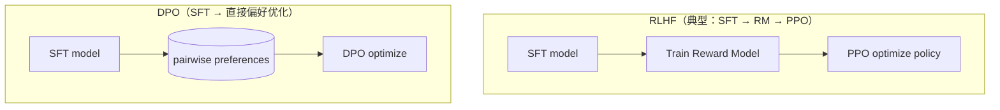

一个常见的“工程现实”：
- 对齐质量不仅来自算法，也高度依赖 **偏好数据的覆盖、难例与标注一致性**。

### 8.3 Constitutional AI / RLAIF（用规则/AI 反馈替代部分人类反馈）

用明确规则约束输出风格与安全边界，可降低对大规模人工标注的依赖，但需要设计高质量宪法与审查流程。

---

## 9. 涌现、推理与提示工程（现象与方法）

### 9.1 涌现能力的典型表现

- **In-Context Learning（ICL）**：提示里给例子即可做新任务
- **Chain-of-Thought（CoT）**：显式中间推理可提升复杂任务

### 9.2 重要提示策略（只保留最常用/最稳健）

- **CoT**：给出“逐步思考”的格式约束
- **Self-Consistency**：采样多条推理链投票提升正确率
- **ReAct**：将“推理（Reason）+ 行动（Act）”结合，用工具调用提升可验证性

**图：ReAct 的推理—行动闭环（示意）**

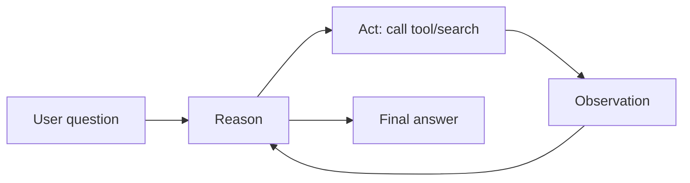

> 注意：许多“推理增强”方法强依赖评测设置与提示细节；在笔记中建议保留“方法—适用场景—失败模式”的三元描述。

---

## 10. 多模态大模型（Vision-Language Models）

### 10.1 动机与核心思路

将视觉/听觉等非文本信号接入 LLM，使其能够"看图说话"、"听音理解"。典型方式：
- **视觉编码器**（如 ViT / CLIP）把图像转成 token 序列或向量
- **投影层 / 适配器**：将视觉 token 与 LLM 的 token embedding 对齐
- **LLM 主干**：处理混合序列（图像 token + 文本 token）

### 10.2 典型架构范式

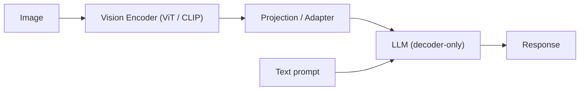

**常见变体**：
- **LLaVA 式**：CLIP 视觉编码 + 线性投影 + LLaMA
- **Flamingo 式**：交叉注意力（Perceiver Resampler）融合多图像
- **Qwen-VL / InternLM-XComposer 式**：大规模指令微调 + 高分辨率支持

### 10.3 训练阶段

通常分两阶段：
1. **预训练对齐**：用大规模图文对（如 LAION）让投影层学会将视觉表示映射到语言空间
2. **指令微调**：用视觉问答、图文对话数据提升交互能力

### 10.4 关键挑战

- **高分辨率 / 多图支持**：更多 token → 更大 KV Cache
- **幻觉**：模型"看错"或"编造"图中细节
- **评测**：视觉理解任务的评测标准仍在演进

**关键文献**：
- LLaVA (2023): Liu et al.
- Flamingo (2022): Alayrac et al.
- CLIP (2021): Radford et al.

---

## 11. 检索增强生成（Retrieval-Augmented Generation, RAG）

### 11.1 动机：缓解知识过时与幻觉

纯参数化 LLM 的问题：
- 知识截止于训练数据
- 难以引用来源，幻觉难以被验证

**RAG 核心思路**：在生成时先从外部知识库检索相关片段，再将其拼入提示，让 LLM "有据可依"。

### 11.2 典型流程

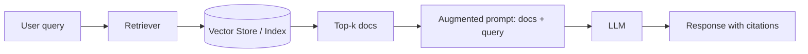

**关键组件**：
- **Embedding 模型**：将文档和查询编码成稠密向量
- **向量数据库**：FAISS、Milvus、Pinecone 等
- **检索器**：稠密检索（双塔）、稀疏检索（BM25）、混合检索
- **读取器 / 生成器**：LLM 消化检索结果并生成回答

### 11.3 进阶技术

- **Reranker**：用更精细的模型对检索结果重新排序
- **Query Rewriting**：改写/扩展用户查询提升召回
- **Chunk 策略**：按段落 / 句子 / 固定长度切分；层级索引
- **Self-RAG / CRAG**：让 LLM 自己决定是否需要检索、检索结果是否可信

### 11.4 常见问题

| 问题 | 表现 | 常见应对 |
|---|---|---|
| 检索不准 | 返回无关段落 | 改进 embedding、混合检索、rerank |
| 上下文过长 | 超出窗口 / KV Cache 爆 | 摘要、压缩、分层检索 |
| 幻觉仍存在 | 模型忽略检索结果 | 指令约束、引用强制、Self-RAG |
| 时效性 | 知识库未及时更新 | 增量索引、在线爬取 |

**关键文献**：
- RAG (2020): Lewis et al.
- REALM (2020): Guu et al.
- Self-RAG (2023): Asai et al.

---

## 12. 代表性模型与路线（仅列与关键技术强相关者）

| 模型/路线 | 年份 | 架构形态 | 与本文主题相关的关键点 |
|---|---:|---|---|
| GPT-2 | 2019 | Dense decoder-only | 大规模自回归预训练范式清晰化 |
| GPT-3 | 2020 | Dense decoder-only | ICL 成为主叙事能力之一 |
| Chinchilla | 2022 | Dense decoder-only | compute-optimal：参数-数据平衡 |
| LLaMA / Llama 2 | 2023 | Dense decoder-only | 工程化高效预训练；GQA 等推理友好设计 |
| Mistral 7B | 2023 | Dense decoder-only | Sliding Window 等长上下文效率路线 |
| Switch Transformer | 2021 | MoE（Transformer） | 稀疏专家路由 + 负载均衡损失 |
| GLaM | 2022 | MoE（decoder-only 为主） | 大规模 MoE 训练与能力展示 |
| Mixtral | 2023 | MoE decoder-only | MoE 在开源推理栈中的代表性落地 |
| LLaVA | 2023 | VLM (CLIP + LLaMA) | 视觉-语言指令微调代表 |
| Flamingo | 2022 | VLM (Perceiver + Chinchilla) | 多图交叉注意力 |
| RAG | 2020 | Dense retriever + BART | 检索增强生成范式开创 |

---

## 参考（仅关键文献，按主题分组）

### 架构与训练
1. Vaswani et al. (2017). *Attention Is All You Need*.
2. Radford et al. (2019). *Language Models are Unsupervised Multitask Learners* (GPT-2).
3. Brown et al. (2020). *Language Models are Few-Shot Learners* (GPT-3).
4. Hoffmann et al. (2022). *Training Compute-Optimal Large Language Models* (Chinchilla).
5. Touvron et al. (2023). *LLaMA: Open and Efficient Foundation Language Models*.
6. Touvron et al. (2023). *Llama 2: Open Foundation and Fine-Tuned Chat Models*.

### 注意力与系统
7. Ainslie et al. (2023). *GQA: Training Generalized Multi-Query Transformer Models*.
8. Dao et al. (2022). *FlashAttention: Fast and Memory-Efficient Exact Attention with IO-Awareness*.
9. Kwon et al. (2023). *vLLM: Easy, Fast, and Cheap LLM Serving with PagedAttention*.
10. Leviathan et al. (2023). *Fast Inference from Transformers via Speculative Decoding*.

### 位置编码与长上下文
11. Su et al. (2021). *RoFormer: Enhanced Transformer with Rotary Position Embedding*（RoPE 思想来源）。
12. Press et al. (2022). *Train Short, Test Long: Attention with Linear Biases Enables Input Length Extrapolation* (ALiBi).

### MoE
13. Shazeer et al. (2017). *Outrageously Large Neural Networks: The Sparsely-Gated Mixture-of-Experts Layer*.
14. Fedus et al. (2021). *Switch Transformers: Scaling to Trillion Parameter Models with Simple and Efficient Sparsity*.
15. Du et al. (2022). *GLaM: Efficient Scaling of Language Models with Mixture-of-Experts*.

### 对齐与推理
16. Ouyang et al. (2022). *Training language models to follow instructions with human feedback* (InstructGPT / RLHF).
17. Rafailov et al. (2023). *Direct Preference Optimization: Your Language Model is Secretly a Reward Model* (DPO).
18. Wei et al. (2022). *Chain-of-Thought Prompting Elicits Reasoning in Large Language Models*.
19. Wang et al. (2022). *Self-Consistency Improves Chain of Thought Reasoning in Language Models*.
20. Yao et al. (2023). *ReAct: Synergizing Reasoning and Acting in Language Models*.

### 多模态
21. Radford et al. (2021). *Learning Transferable Visual Models From Natural Language Supervision* (CLIP).
22. Liu et al. (2023). *Visual Instruction Tuning* (LLaVA).
23. Alayrac et al. (2022). *Flamingo: A Visual Language Model for Few-Shot Learning*.

### 检索增强
24. Lewis et al. (2020). *Retrieval-Augmented Generation for Knowledge-Intensive NLP Tasks* (RAG).
25. Guu et al. (2020). *REALM: Retrieval-Augmented Language Model Pre-Training*.
26. Asai et al. (2023). *Self-RAG: Learning to Retrieve, Generate, and Critique through Self-Reflection*.

---

## 关键术语速查（更新版）

| 术语             | 缩写        | 一句话说明                           |
| -------------- | --------- | ------------------------------- |
| 因果自注意力         | Causal SA | 注意力只看历史 token，保证自回归             |
| 多查询注意力         | MQA       | 多 Q 头共享同一组 K/V，显著省 KV Cache     |
| 分组查询注意力        | GQA       | 介于 MHA 与 MQA 之间，质量/效率折中         |
| FlashAttention | -         | 通过 IO-aware 内核显著提升注意力吞吐         |
| 旋转位置编码         | RoPE      | 通过旋转变换注入相对位置信息，常用于 decoder-only |
| 线性偏置注意力        | ALiBi     | 用线性距离偏置获得更强长度外推                 |
| 稀疏专家混合         | MoE       | 每 token 激活少数专家，扩参不线性扩算          |
| 连续批处理          | -         | 推理中动态拼批，提升服务吞吐                  |
| PagedAttention | -         | KV Cache 分页管理，降低碎片提升利用率         |
| 推测式解码          | -         | 小模型提案、大模型验证，加速生成                |
| 强化学习对齐         | RLHF      | 用偏好信号训练模型更符合人类期望                |
| 直接偏好优化         | DPO       | 不显式训练奖励模型，直接从偏好对优化              |
| 视觉语言模型         | VLM       | 将视觉信号接入 LLM 实现多模态理解             |
| 检索增强生成         | RAG       | 先检索外部知识再生成，缓解幻觉与知识过时            |
| 向量数据库          | Vector DB | 存储嵌入向量并支持近邻检索                   |
| Reranker       | -         | 对检索结果二次精排                       |

